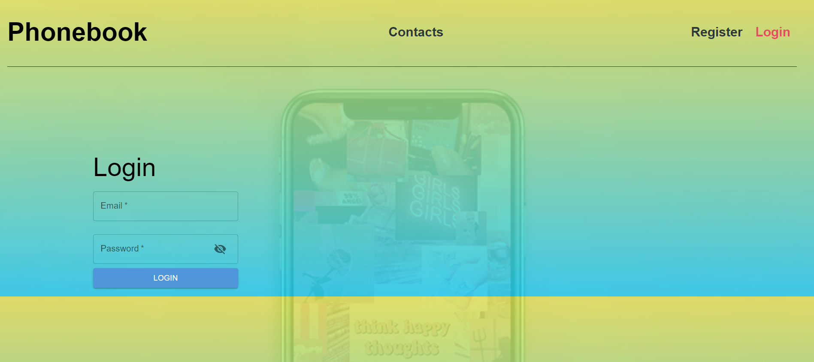

The Phonebook App is a simple web application built with React that allows you
to store and manage your contacts. You can add new contacts, search for existing
contacts, and delete contacts from the phonebook.
"C:\Users\Yana\Pictures\Screenshots\Screenshot 2023-05-22 115658.png"

 
 
Features

Add new contacts with a name and phone number Search for contacts by name Delete
contacts from the phonebook Responsive design for optimal viewing on various
devices
